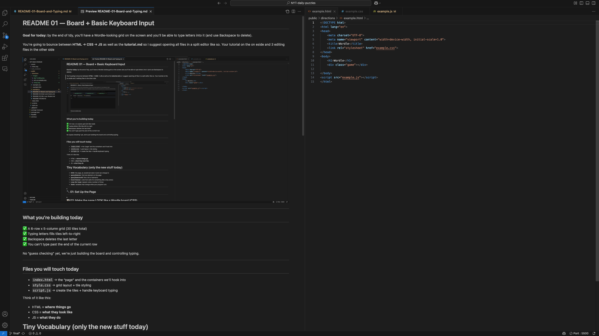
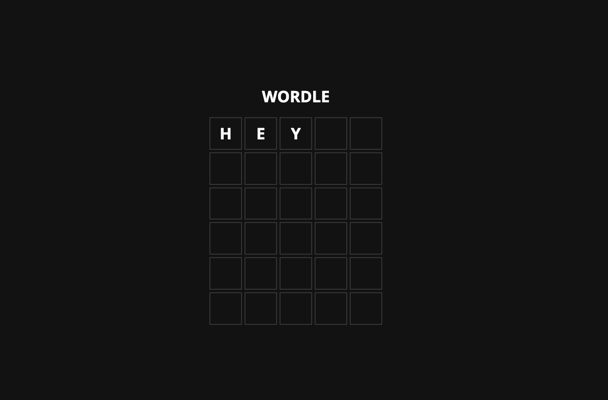

# README 01 — Board + Basic Keyboard Input

**Goal for today:** by the end of tdy, you’ll have a Wordle-looking grid on the screen and you’ll be able to type letters into it (and use Backspace to delete).

You’re going to bounce between **HTML → CSS → JS**  as well as the **tutorial.md** so I suggest opening all files in a split editor like so. Your tutorial on the one side ( left ) and 3 editing files in the other side ( right )



---

## What you’re building today
✅ A 6-row x 5-column grid (30 tiles total)  
✅ Typing letters fills tiles left-to-right  
✅ Backspace deletes the last letter  
✅ You can’t type past the end of the current row

No “guess checking” yet, we’re just building the board and controlling typing.

---

## Files you will touch today
- `index.html` → the “page” and the containers we’ll hook into
- `style.css` → grid layout + tile styling
- `script.js` → create the tiles + handle keyboard typing

Think of it like this:
- HTML = **where things go**
- CSS = **what they look like**
- JS = **what they do**

# Tiny Vocabulary (only the new stuff today)

* **DOM**: the page, as JavaScript sees it (and can change it)
* **querySelector**: find one element on the page
* **querySelectorAll**: find a list of elements
* **Event listener**: code that waits for something (like a key press)
* **Loop (for loop)**: repeats code a number of times
* **State**: variables that change while your program runs

---

<details close>

<summary> <strong> <h1> 🔧  01: Set Up the Page </h1> </strong>  </summary>


### In `index.html` you need:

1. A link to your CSS
2. A link to your JS
3. A container for the game grid

---

### 1️⃣ Generate the base HTML

Type `html:5` and press **Enter**.

You should get:

```html
<!DOCTYPE html>
<html lang="en">
<head>
  <meta charset="UTF-8">
  <meta name="viewport" content="width=device-width, initial-scale=1.0">
  <title>Document</title>
</head>
<body>
  
</body>
</html>
```

---

### 2️⃣ Link your CSS

Inside `<head>`, under `<title>`, type `link:css` and press **Enter**.

```html
<link rel="stylesheet" href="style.css" />
```

---

### 3️⃣ Link your JavaScript

Right after `</body>`, type `script:src` and press **Enter**. Also make sure to fill in the src properly

```html
<script src="script.js"></script>
```

---

### 4️⃣ Add the game elements

Now:

* Change the `<title>` to `"Wordle"`
* Add an `<h1>` inside `<body></body>`
* Add a `<div>` with class `"game"`

Final result:

```html
<!DOCTYPE html>
<html lang="en">
  <head>
    <meta charset="UTF-8" />
    <meta name="viewport" content="width=device-width, initial-scale=1.0" />
    <title>Wordle</title>
    <link rel="stylesheet" href="style.css" />
  </head>

  <body>
    <h1>WORDLE</h1>
    <div class="game"></div>
  </body>
  <script src="script.js"></script>
</html>
```

---

### Why this matters (short version)

* The `<link>` loads your styles.
* The `<script>` runs your JavaScript.
* The `.game` div is where your tiles will be created.


</details>

<details close>

<summary> <strong> <h1> 👀  02: Make the page LOOK like a Wordle board (CSS) </h1> </strong>  </summary>


BEFORE we create tiles, we need to set up the “grid area” so when tiles appear, they snap into place.

Open `style.css` and add:

```css
/* font import for open sans ( font closest to original wordle ) */
@import url('https://fonts.googleapis.com/css2?family=Open+Sans:ital,wght@0,300..800;1,300..800&display=swap');

/* color vars: all the colors we'll need for this saved as variables*/
:root {
    --black: #111112;
    --gray: #3b3b3d;
    --green: #528c4d;
    --yellow: #b59e3a;
    --white: #ffffff;

}

/* A default to center so things don’t hug the edges */
body {
    width: 100vw;
    height: 100vh;
    display: flex;
    flex-direction: column;
    justify-content: center;
    align-items: center;
    background-color: var(--black);
    margin: 0;
    font-family: "Open Sans", sans-serif;
    font-weight: bold;
}

h1 { 
    color:var(--white);
    text-transform: uppercase;
}

/* The board container */

.game {
    /* determine size */
    width: 350px;
    height: 420px;
    /* create grid */
    display: grid;
    grid-template-columns: repeat(5, 1fr);
    grid-template-rows: repeat(6, 1fr);
    gap: 5px;
}
```

### What you just did

* `display: grid` turns `.game` into a **grid layout**
* `grid-template-columns: repeat(5, 1fr)` means:

  * “make 5 columns”
  * “each one is one share of the available space in a grid container”
* `grid-template-rows: repeat(6, 1fr)` means:

  * “make 6 rows”
  * “each one is one share of the available space in a grid container”
* `gap: 10px` gives spacing between tiles

Right now, you still won’t see tiles  because we haven’t created them yet.
But now the board is “ready.”

---

</details>

<details close>

<summary> <strong> <h1> 🟩 03: Create the tiles with JavaScript (JS)</h1></strong>  </summary>


Now the scripting part: we’re going to generate 30 tile elements using a loop.

Open `script.js` and add:


```js
/********************
 DOM + constants
********************/

// 1) Get the game container from HTML
const gameContainer = document.querySelector(".game");

// 2) Define board size
const rows = 6;
const columns = 5;

/********************
 Build board
********************/

function createBoard() {
  // Create rows * columns tiles (6 * 5 = 30)
  for (let i = 0; i < rows * columns; i++) {
    const box = document.createElement("div");
    box.className = "box";
    gameContainer.appendChild(box);
  }
}

createBoard();
```

### What’s happening here

* `document.querySelector(".game")` means:

  * “Find the first thing on the page with class `game`”
* `createElement("div")` means:

  * “Create a brand new `<div>`”
* `appendChild(box)` means:

  * “Put that new div inside the game container”

### Why we use a "for loop"

When we want to do something repeatedly we can use a for-loop.

We want 30 tiles. We **could** write 30 divs in HTML… but that’s slow and easy to miss a div and break, so instead we use a loop

Loops need 3 things: an intializer, a condition, and update

``` js
  for (intiliazer; condition; update)

  or 
  for (let i = 0; i < rows * columns; i++)
  // i = 0 -  intialize the count as zero
  // i < rows * columns " - as long as i is less than 5x6 ( or 30)
  // i++ , update i + 1 ( counts up, eventually to 30 ) 

```

So our loop lets us say:

> “Do this 30 times.”s

---

</details>

<details close>

<summary> <strong> <h1>  🎨 04: Style the tiles (CSS) </h1> </strong>  </summary>


Now that tiles exist, we can make them look like Wordle tiles.

Back to `style.css`, add:

```css
.box {
    border: 2px solid var(--gray);
    /* center text in box */
    display: flex;
    justify-content: center;
    align-items: center;
    /* style text */
    font-size: 2rem;
    font-weight: bold;
    color: var(--white);
    text-transform: uppercase;
    user-select: none;
}
```

### What this does

* `border` makes the tile visible with a white border
* `place-items: center` centers the letter inside the tile
* `text-transform: uppercase` forces letters to display as uppercase
* `user-select: none` prevents highlight-selecting tiles when you drag the mouse

✅ Refresh the page: you should see a 6x5 grid of empty tiles.

---

</details>

<details close>

<summary> <strong> <h1> ⌨️ 05: Let players type letters into the tiles (JS) </h1> </strong>  </summary>

Now we’ll teach the game to respond to keyboard input.

### First, grab all the boxes

In `script.js`, right after `createBoard();`, add:

```js
const boxes = document.querySelectorAll(".box");
```

**What this is:**
`querySelectorAll` returns a **list** (like an array) of every tile element.

---

## Add “game state” for typing

We need to track where typing should go.

Add:

```js
/********************
Game state (changes)
 ********************/
let currentBox = 0;   // Which tile index we’re typing into (0 to 29)
let currentRow = 1;   // Which row we’re on (1 to 6)
let currentGuess = []; // Letters typed in the current row
```

### Why we need these

If someone types “H E L L O”, we need to know:

* which tile gets H
* which tile gets E
* and when to stop at 5 letters

That’s what state variables are: **the changing info the game remembers.**

---
</details>

<details close>

<summary> <strong> <h1> 🚫 06:  Prevent typing past the row (helper functions) </h1> </strong>  </summary>


This part is surprisingly important: Wordle only lets you type **5 letters per row**.

Add these helpers:

```js
/********************
Helpers (small math)
********************/
function rowStart(row) {
  return columns * (row - 1);
}

function rowEnd(row) {
  return columns * row;
}
```

### What these return (examples)

If `columns = 5`:

* Row 1 starts at tile `0` and ends at tile `5`
* Row 2 starts at tile `5` and ends at tile `10`
* Row 3 starts at tile `10` and ends at tile `15`

So:

* `rowStart(1) → 0`
* `rowEnd(1) → 5`  (end is “exclusive”, like “stop before 5”)

---

</details>

<details close>

<summary> <strong> <h1> 👂 07:  Listen for keyboard presses (JS) </h1> </strong>  </summary>


Now we’ll respond when the player presses keys.

Add:

```js
/********************
Input loop (event listener)
********************/
// keydown event, e = event object, 
document.addEventListener("keydown", (e) => {
  // e.key = key that was pressed
  const key = e.key;

  // Stop typing if the row is full
  if (currentBox >= rowEnd(currentRow)) return;

  // Only accept letters A-Z ( uppercase or lowsercase)
  if (key.length === 1 && key.match(/[a-z]/i)) {
    boxes[currentBox].innerHTML = `<span class="letter">${ key.toUpperCase() }</span>`;
    currentGuess = [...currentGuess, key.toUpperCase()];
    currentBox++;
  }
});
```

### To simplify

* `keydown` fires whenever a key is pressed
* `e.key` is the exact key (like `"a"`, or later `"Enter"`, `"Backspace"`)
* `key.length === 1` helps filter out keys like `"Shift"` or `"Enter"`
* `match(/[a-z]/i)` means “only letters”
* `boxes[currentBox].textContent = ...` puts the letter into the tile
* `currentBox++` adds +1 to the value , moves us to the next tile

✅ Refresh and try typing. Letters should appear.

---

</details>

<details close>

<summary> <strong> <h1> 🔙 08: Add Backspace (deleting letters) </h1> </strong>  </summary>


We need to support:

* deleting the last typed letter
* moving the cursor backwards
* removing that letter from the guess

Update your event listener to include Backspace:

```js
document.addEventListener("keydown", (e) => {
  const key = e.key;

  //////////////////////
  // PREVIOUS CODE ⬆️
  //////////////////////

  // BACKSPACE: delete the previous letter
  if (key === "Backspace") {
    // Don’t let them delete into the previous row
    if (currentBox > rowStart(currentRow)) {
      currentBox--;
      boxes[currentBox].textContent = "";
      currentGuess.pop();
    }
    return;
  }

  //////////////////////
  // PREVIOUS CODE ⬇️
  //////////////////////


  // Stop typing if the row is full
  if (currentBox >= rowEnd(currentRow)) return;

   // Only accept letters A-Z ( uppercase or lowsercase)
  if (key.length === 1 && key.match(/[a-z]/i)) {
    boxes[currentBox].innerHTML = `<span class="letter">${ key.toUpperCase() }</span>`;
    currentGuess.push(key.toUpperCase());
    currentBox++;
  }
});
```

### Why this works

* We handle Backspace first, then `return` so it doesn’t fall through
* `currentBox--` moves us back one tile
* we clear that tile and remove the last letter from `currentGuess`
* `rowStart(currentRow)` prevents backspacing into previous rows

✅ Refresh and test Backspace.

---

## 🎉 Checkpoint: You finished Day 1

You now SHOULD have something that looks like this:



* a real Wordle board
* typing that fills tiles
* backspace deletion
* row boundaries (5 letters max)

---

<details>


---

## Next README (Day 2 preview)

Tomorrow you’ll add:

* Enter key to “submit” a guess
* a real secret word
* and tile colors (green/yellow/gray)
